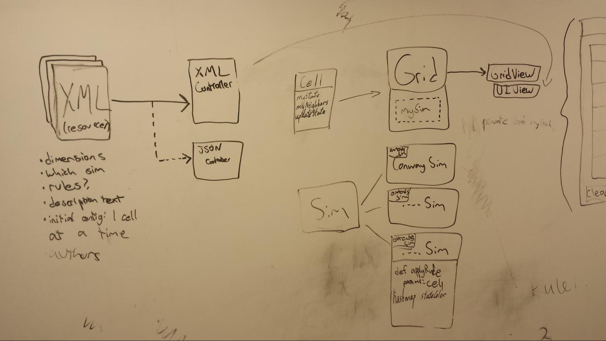
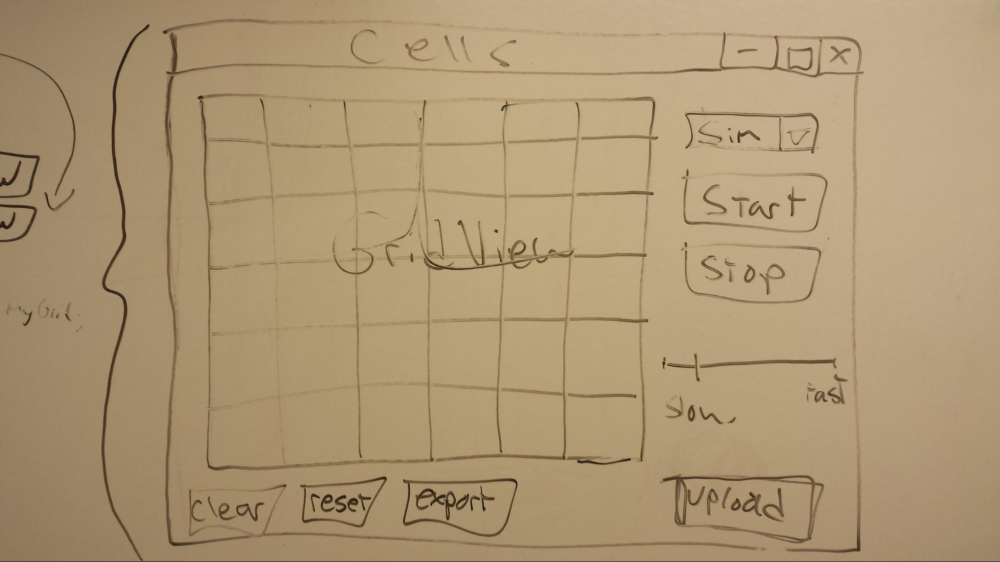

CompSci 308: Cell Society Design
=====
### Introduction
The primary goal of this project is to simulate a variety of cellular automata within a user interface, based on the xml files that are selected as input. The simulation will be displayed on a grid, and the same grid should be capable of supporting any simulation that is fed into it via XML file. The primary design goals are having code that is flexible which is also done in a clean coding style. We hope to achieve this by having a hierarchy of simulations, which hopefully will make addition of new simulations simpler and keep our code regarding each simulation cleaner and more discrete. We are approximately following a Model, View, Controller pattern to keep our user interface and graphics separate from our game logic and resource files. The user should have the options to pause and increment the simulation, change the simulation speed and to switch simulations, and the simulation should be able to run indefinitely. This project needs to be open towards the types of simulations it can support with their different parameters, such as possible number of active number states or configuration of rules, and the visualization of different possible states must be clear to user during the simulation. This project needs to be closed in the way cells are updated, as all the cells in the grid need to be read and checked against the rules of the simulation in one pass and then updated in the next pass. 

-----

### Overview and Design Details
#### Simulation
###### Cell
The cell class will contain a set of variables specific to each cell such as current and next state and a 1D array of points to its neighbors. The next state variable is necessary so it can hold the information for what the cell should be updating to without altering the cells next to it as they are reading the states of their neighbors. This class with have a method to update the cell, setting its current state to its next state so the next sweep would have new data to read. When the cell is passed to the simulation to check its neighbors against the rules, the simulation can retrieve either all of the pointers to the cell’s neighbors or one specific pointer to a neighbor in order to check their states. Edge cells and corner cells will set their nonexistent neighbors to NULL in their neighbor array, which will be handled in the simulations accordingly. This allows us to keep track of the locations of the neighbors (by corresponding to the neighbor’s position in the array) and not just how many neighbors there are. Cells will also store their Color.
###### Grid Class
The grid class will contain all the cells that are a part of the simulation. It is responsible for evoking the selected simulation to check each of the cells contained within it against the rules.
###### Simulations
We are planning to make a simulation hierarchy, where each individual simulation would be a subclass of the hierarchy. The superclass would hold abstract methods that would be common to each simulation such as checking cells against the rules of the simulation. The individual rules and states for each simulation would be contained within its own class. Each cell in the grid would be passed into an object of the simulation class so that it and its neighbours can be checked against the rules within the simulation class in order to determine what the next state of the cell ought to be in some kind of getNextState() function. Because each simulation may have a different set of states and visualization of those states, the simulation has a hashMap associating each state to some kind of visualization parameter, such as pairing a state to showing a certain color. On the first pass, each cell and its neighbours is checked against the rules via a getNextState() function, and it updates what the next state and next color of the cell should be. 
* Segregation
* Predator-Prey
* Fire
* Game of Life
* Any others that are imported as an XML file

#### Configuration
Simulations will be configured with an XML file with named fields describing the title, author, simulation type, grid dimensions, and a written description of the simulation. In addition, the files will set the initial configuration of the grid by setting the initial state of one cell at a time (specified by its xy coordinate in the grid, and its initial state) and a default state to be applied to all of the cells not mentioned in this manner. In addition, the XML file will set values specifying the color of each state.
The XML configuration files can be selected and loaded through a regular file browser, accessible through the GUI. The parsing and processing will be handled by a dedicated XMLController class. The XMLController will be created by UIView and given an XML file and a pointer to an unitialized Grid. It will initialize the Grid with the initial configuration/dimensions and the simulation type. UIView will poll XMLController for the info it needs (author, title, description text). After that, the XMLController will no longer be referenced by the program. If a new configuration is loaded a new XMLController will be created.

#### Visualization
The visual presentation of the simulation will be managed by a GridView class, which will be responsible for accessing the states of each cell in the grid and producing the appropriate visual effects. The GridView display on the window will have a fixed size, and it will display the current state of the Grid object that is currently being simulated on. It will have to have methods for handling the visual representations for each cells, where it will have to determine the size of each cell based on the dimensions input via the XML file when initializing the simulation. 

There will be a UI  view class that is responsible for producing the user interface. The interface will have methods to produce visual elements such as buttons and a sliding scale to control simulation speed. These buttons will start, stop and increment the simulation, and will acquire any required text from the XML file.

#### Use Cases
> Apply the rules to a middle cell: set the next state of a cell to dead by counting its number of neighbors using the Game of Life rules for a cell in the middle (i.e., with all its neighbors)

getNextState() will check the states of neighbors in the cell’s associated myNeighbors field, and based on the number of live neighbors, decide if the cell is to die or live
> Apply the rules to an edge cell: set the next state of a cell to live by counting its number of neighbors using the Game of Life rules for a cell on the edge (i.e., with some of its neighbors missing)

getNextState() check the states of neighbors in the cell’s associated myNeighbors field, and based on the number of live neighbors, decide if the cell is to die or live
> Move to the next generation: update all cells in a simulation from their current state to their next state and display the result graphically

Iterate through every cell in the grid twice, setting what the next state should be on the first pass and updating the states on the grid on the second pass.
> Set a simulation parameter: set the value of a parameter, probCatch, for a simulation, Fire, based on the value given in an XML fire

The XML Controller will store arbitrary parameters into a HashMap, which each simulation as a key. The simulation class Fire will get its parameter through this HashMap.
> Switch simulations: use the GUI to change the current simulation from Game of Life to Wator

Click on upload, and browse to the XML file that describes the configuration for Wator.

-----

### User Interface
The user will interact with the simulation primarily through several buttons and components beside the grid. First, a load button will launch a file browser, allowing the user to select an XML configuration file. A start button will begin the simulation, a stop button will pause the simulation, and a slider will control the speed of the simulation. A reset button will restart the simulation from its initial configuration.

-----

### Design Considerations
Having the simulations read from the XML data files would provide a lot of additional flexibility, but we are still thinking about how best to implement this.

Cell hierarchy - We discussed whether or not there should be a superclass for cells with edge, corner, and middle cells as subclasses or not. An advantage of having a hierarchy would be not having to cover a NULL case when the neighbors are checked. However, by not knowing future requirements, we are currently unsure about whether implementing this would be wise.

We discussed whether or not to integrate the Cell’s abstract representation with its graphics, including the possibility of having Cell extend javafx.Rectangle or a similar class. This topic came up again when we discussed where the colors of cells would be determined, and whether they would be configurable through XML. We decided to hardcode colors in their respective simulation classes (since we were already hardcoding the rules of the simulations), although we could easily change this in the future. We decided that the Cell would store its current color in an instance variable, but that it would not be responsible for drawing itself. This design was chosen so that we could keep the drawing logic confined to GridView, and so that the Cell objects would not need to concern themselves with their pixel xy location, width, height, etc. The reason the Cell was given knowledge of its color is that it allows GridView to easily ask for it, and allows us to avoid giving GridView a simulation-specific state->color map. 

-----

### Team Responsibilities
We have separated this project into three main components: front-end, back-end, and XML. Jasper is going to handle the XML files and XML Controller, keeping in mind the communications among those and the UI View. Collin is handling the front-end JavaFX in GridView, the Grid, and UI View. He will be checking on communication among those classes and XML as well. Brenna is writing the back-end code, handling the logic behind how the cells and simulations work, ensuring the separate simulations are able to be run from Grid easily and efficiently. We are each forking the repository so we will have to merge using pull requests, but no team member is allowed to merge their own request. This allows us to have multiple eyes on the code before it is merged into the master. We are setting up team meetings to discuss cross-over and keep each other updated on the different aspects of the game so no one team member is isolated from the rest of the project.
